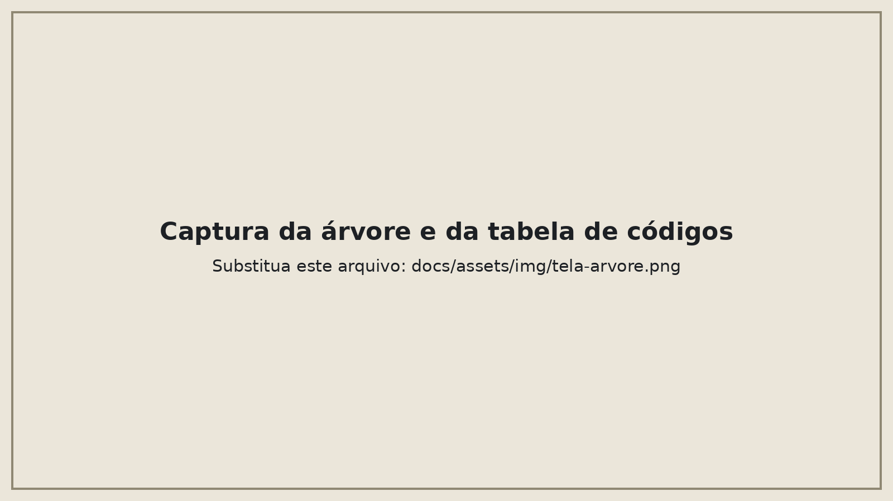
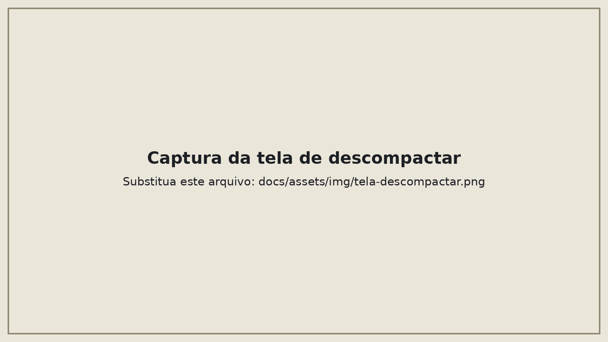

# O algoritmo

O código de Huffman troca os 8 bits fixos de cada letra por códigos de tamanho variável. Quem aparece muito ganha um código curto, quem aparece pouco ganha um código longo.

## Por que é guloso

A cada passo o algoritmo faz a escolha que parece melhor naquele momento: juntar os dois nós de menor peso. Essa escolha nunca é desfeita.

Ela dá certo porque os dois símbolos mais raros sempre podem ficar lado a lado no ponto mais fundo da árvore sem piorar o resultado. Por isso juntá-los primeiro nunca atrapalha o que vem depois.

## Os passos

1. Contar quantas vezes cada símbolo aparece.
2. Colocar um nó por símbolo em uma heap de mínimo, com o menor peso na raiz.
3. Retirar os dois nós mais leves.
4. Juntá-los em um nó novo, com peso igual à soma. O primeiro retirado vai para a esquerda (bit 0) e o segundo para a direita (bit 1). O nó novo volta para a heap.
5. Repetir os passos 3 e 4 até sobrar um nó só, a raiz.

O caminho da raiz até cada folha é o código do símbolo.

## Exemplo

O texto `Universidade_de_Brasília` tem 24 caracteres e 13 símbolos diferentes.

| Símbolo | Vezes | Código |
| --- | --- | --- |
| `_` | 2 | `000` |
| `í` | 1 | `0010` |
| `l` | 1 | `0011` |
| `a` | 3 | `010` |
| `e` | 3 | `011` |
| `i` | 3 | `100` |
| `d` | 3 | `101` |
| `v` | 1 | `11000` |
| `B` | 1 | `11001` |
| `s` | 2 | `1101` |
| `U` | 1 | `11100` |
| `n` | 1 | `11101` |
| `r` | 2 | `1111` |

O texto codificado ocupa 86 bits, contra 200 bits no original (o `í` ocupa 2 bytes em UTF-8).

??? note "As 12 junções do exemplo"
    | Junção | Nós retirados | Peso do nó novo |
    | --- | --- | --- |
    | 1 | `U` e `n` | 2 |
    | 2 | `v` e `B` | 2 |
    | 3 | `í` e `l` | 2 |
    | 4 | `_` e `íl` | 4 |
    | 5 | `Un` e `r` | 4 |
    | 6 | `vB` e `s` | 4 |
    | 7 | `i` e `d` | 6 |
    | 8 | `a` e `e` | 6 |
    | 9 | `vBs` e `Unr` | 8 |
    | 10 | `_íl` e `ae` | 10 |
    | 11 | `id` e `vBsUnr` | 14 |
    | 12 | `_ílae` e `idvBsUnr` | 24 |

## Por que usar uma heap

A heap entrega o menor nó em tempo O(log k), em vez de ordenar a lista inteira a cada junção.

| Etapa | Custo |
| --- | --- |
| Contar as frequências | O(n) |
| Montar a heap | O(k) |
| k − 1 junções, cada uma com 2 retiradas e 1 inserção | O(k log k) |
| Codificar o texto | O(n) |

Aqui `n` é o número de caracteres do texto e `k` é o número de símbolos diferentes.

## Empates

Quando dois nós têm o mesmo peso, a heap escolhe o da esquerda. O critério é fixo, e a descompactação refaz exatamente a mesma árvore a partir das frequências guardadas no cabeçalho.

## O arquivo `.huff`

Ele tem um cabeçalho (assinatura `HUF`, versão e a lista de símbolos com suas frequências) seguido dos bits codificados. Sem o cabeçalho não dá para refazer a árvore.

Em textos curtos o arquivo compactado pode ficar maior que o original, porque o cabeçalho pesa mais que a economia. No exemplo, 25 bytes viram 43. Em textos maiores e repetitivos o ganho aparece.

