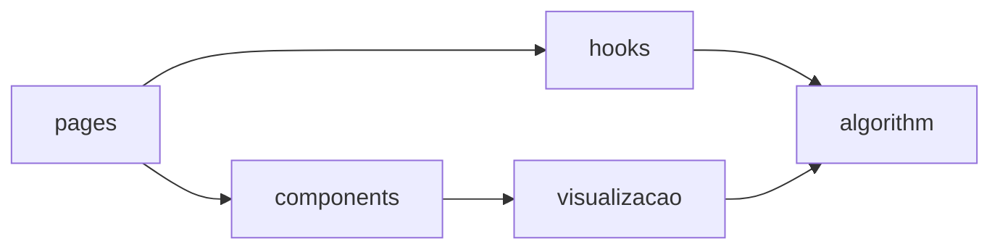

# Estrutura do projeto

O projeto é um site em React com Vite. A regra principal: o algoritmo não conhece o React, e os componentes só recebem dados prontos.



## Pastas de `src/`

| Pasta | O que tem |
| --- | --- |
| `algorithm/` | O algoritmo de Huffman, sem React |
| `visualizacao/` | Layout da árvore e da heap, quadros do passo a passo |
| `components/` | Blocos da interface, um por responsabilidade |
| `hooks/` | Estado das telas: ler arquivo, compactar, descompactar, player |
| `pages/` | As telas: envio, resultado, descompactar, texto recuperado |
| `contexts/` | Navegação entre as abas |
| `utils/` | Leitura de arquivos e formatação de números |
| `config/` | Limites, como o tamanho máximo do arquivo |
| `styles/` | Cores, fontes e espaçamentos |

## Dentro de `algorithm/`

| Pasta | Função |
| --- | --- |
| `heap/` | Min-heap com subir e descer |
| `frequency/` | Conta quantas vezes cada símbolo aparece |
| `tree/` | Nós e montagem da árvore usando a heap |
| `codes/` | Gera o código de cada símbolo |
| `bits/` | Transforma o texto em bits e os bits em bytes |
| `format/` | Cabeçalho do arquivo `.huff` |
| `decode/` | Lê os bits e recupera o texto |
| `stats/` | Tamanhos, taxa de compressão e entropia |
| `pipeline/` | `compactar` e `descompactar`, juntando tudo |

## Testes

Cada módulo do algoritmo tem seu arquivo `.test.js`. Os testes incluem o exemplo `Universidade_de_Brasília`, textos vazios, um símbolo só e arquivos corrompidos.

```bash
npm test
```
