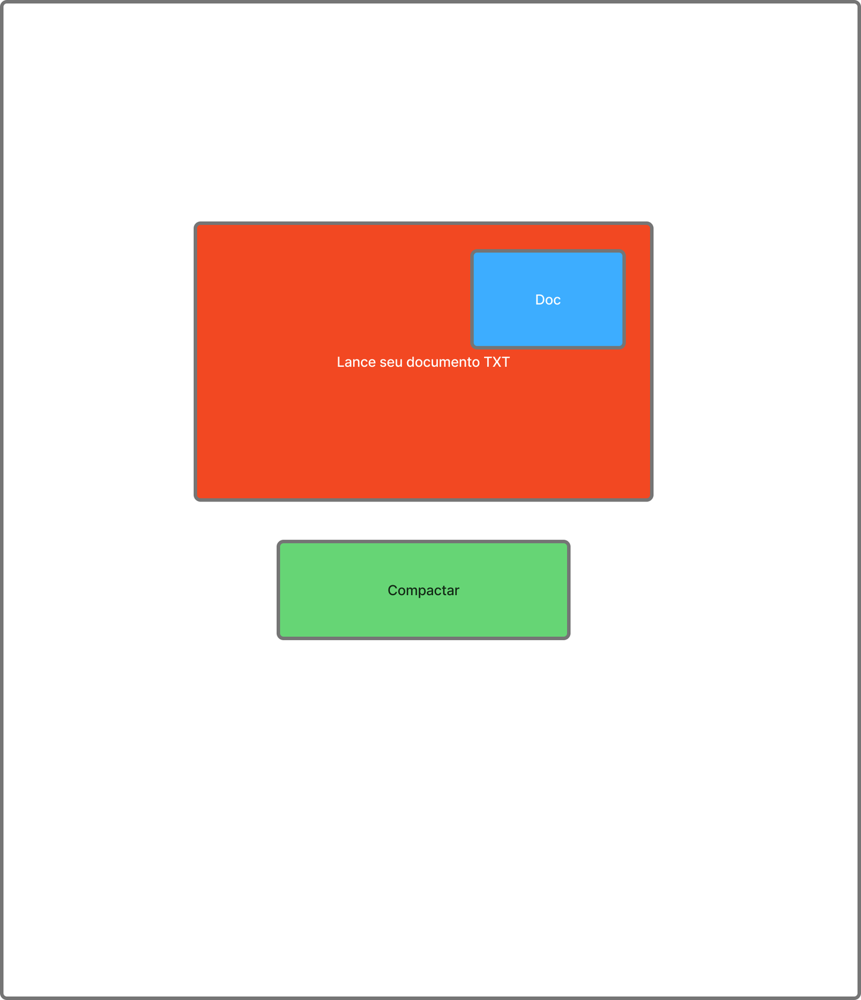
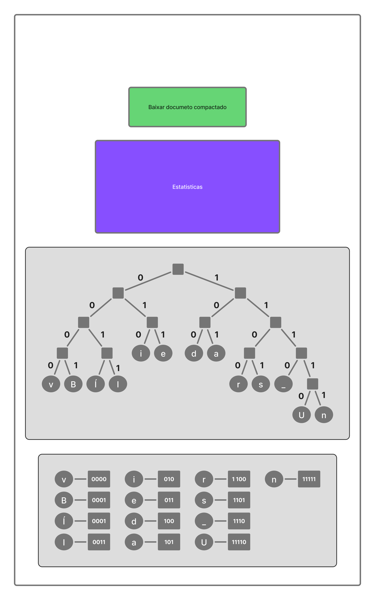
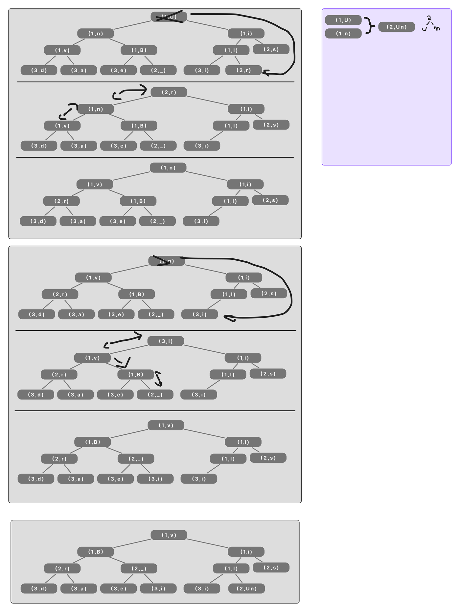
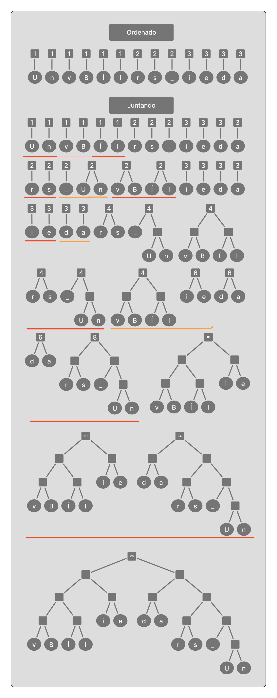

# Protótipo no Figma

## Figma Completo

<iframe style="border: 1px solid rgba(0, 0, 0, 0.1);" width="800" height="450" src="https://embed.figma.com/board/hnR5aYXMPHdfKCUEkCqu54/Projeto-de-Algoritmo---Ambicioso--?node-id=18-1745&embed-host=share" allowfullscreen></iframe>

## Imagem Figma

Antes de programar, desenhamos as telas e o passo a passo no Figma. O site final mudou de visual, mas manteve a mesma estrutura: envio do arquivo, resultado e passo a passo.

<figure markdown>

<figcaption>Tela inicial: área para soltar o arquivo e botão de compactar.</figcaption>
</figure>
<figure markdown>

<figcaption>Resultado: botão de baixar, estatísticas, árvore e códigos.</figcaption>
</figure>

## O passo a passo

O rascunho da heap mostra o menor nó saindo e a heap se reorganizando. Foi essa ideia que virou o player do site.

<figure markdown>

<figcaption>Heap: o menor nó sai e o último ocupa a raiz.</figcaption>
</figure>
<figure markdown>

<figcaption>Junção dos nós até sobrar a raiz.</figcaption>
</figure>

