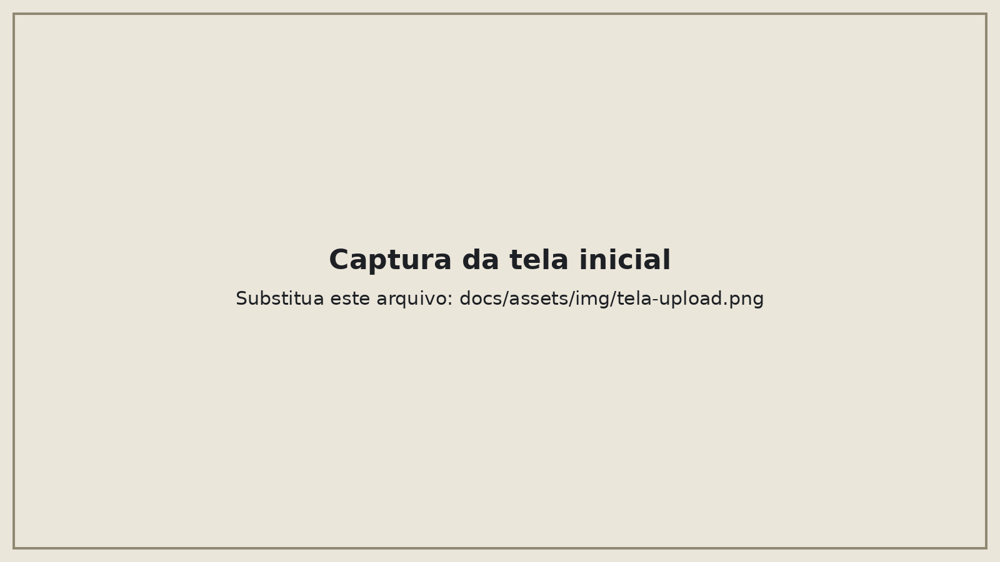
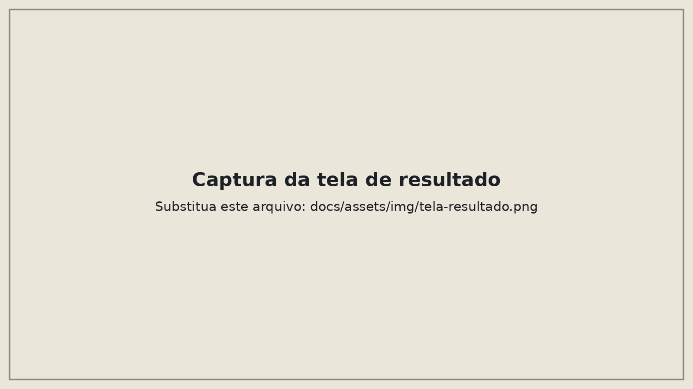

# Compactador Huffman

Site que compacta arquivos de texto com o algoritmo de Huffman e mostra, passo a passo, como a árvore e os códigos são construídos. Ele também descompacta o arquivo gerado.

Trabalho de Projeto de Algoritmos sobre algoritmos gulosos, grupo 15.



## O que dá para fazer

- Enviar um arquivo `.txt` e baixar o arquivo compactado (`.huff`).
- Ver o tamanho antes e depois, a árvore e a tabela de códigos.
- Acompanhar a heap troca por troca, até a árvore ficar pronta.
- Enviar um `.huff` e recuperar o texto original.

O site aceita arquivos de até 5 MB, em UTF-8.



## Como rodar

```bash
git clone https://github.com/projeto-de-algoritmos-2026/G15_Greedy_PA-26.2.git
cd G15_Greedy_PA-26.2
npm install
npm run dev
```

Para rodar os testes: `npm test`.
